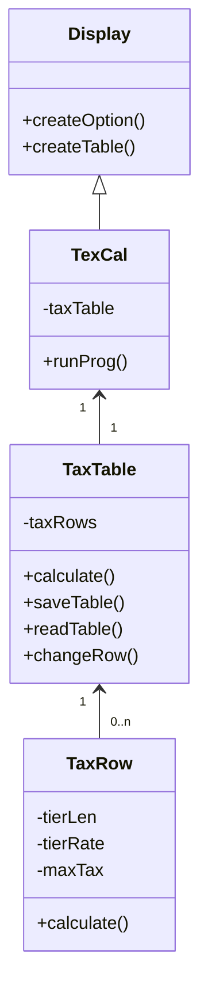

#  个人所得税计算器 程序设计文档

[TOC]

## UML类图

```mermaid
classDiagram
	class Display{
		+createOption()
		+createTable()
	}
	
    class TexCal{
    	-taxTable
    	+runProg()
    }
    Display <|-- TexCal

    class TaxTable{
    	-taxRows
    	+calculate()
    	+saveTable()
    	+readTable()
    	+changeRow()
    }
    TexCal "1" <-- "1" TaxTable
    
    class TaxRow{
    	-tierLen
    	-tierRate
    	-maxTax
    	+calculate()
    }
    TaxTable "1" <-- "0..n" TaxRow
```

