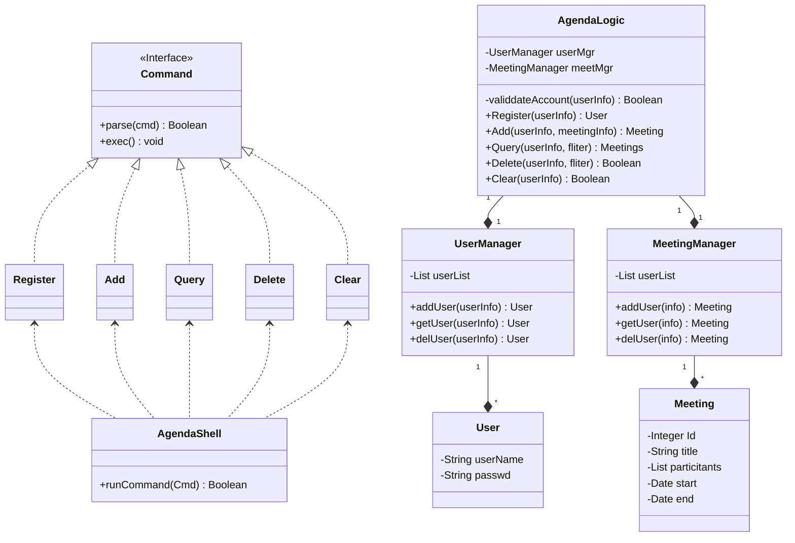
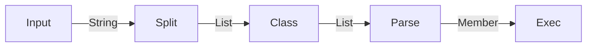
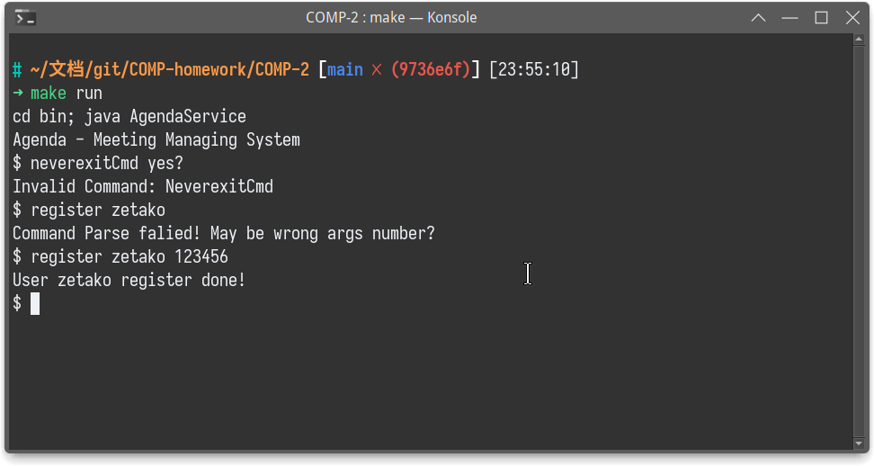
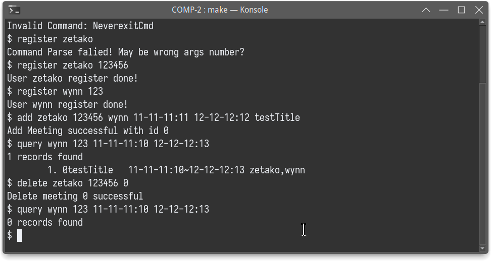
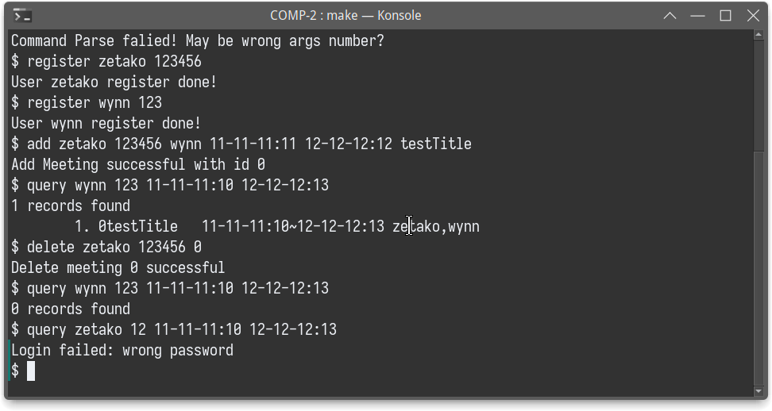

 

# Agenda - 议程管理系统

| 姓名     | 张烨禧   | 学号     | 18340216           |
| -------- | -------- | -------- | ------------------ |
| 完成时间 | 2021/4/8 | 联系方式 | zetako@outlook.com |

[TOC]

## UML类图与设计



根据上述的UML类图可以看到，我们的程序实际上分为两层，内层是业务逻辑层，负责实际的业务逻辑处理；外层是解析层，负责解析用户的输入。

### 业务逻辑层

我们需要管理的对象主要有两种，一种是用户，我们将其抽象为`User`类；另一种是用户的议程/会议，我们将其抽象为`Meeting`类。他们都储存其所需的数据：`User`存储用户名和密码，`Meeting`存储议程号、议程标题、参与者和时间。

这两种类只负责其自身数据的存取，无法独立完成管理自身及其同伴的任务，因此我们还需要安排两个管理类来实现管理功能，也就是`UserManager`和`MeetingManager`；这两个类分别拥有多个各自的成员。所谓管理功能也就是增删查改，这里我们的需求比较简单，因此我们仅为其赋有增、删、查的功能。详细的来说，用户的查找、删除需要考虑到安全性（密码验证），而会议的查找则需要提供多种查找方式，例如通过Id查找、通过时间段查找，通过用户查找等。

最后，这两个管理类不能重复实例化，因此我们还需要有一个顶层的管理类来负责为这两个类初始化，并负责二者的对外通讯，这里我们将任务交给`AgendaLogic`类，他负责外围和这两个管理类的通信。其具体的通讯方式应该与我们提供的接口相同。

### 解析层

解析层的关键是`AgendaShell`类，这个类一方面接受用户输入，另一方面还要调用具体的函数对传入的参数进行解析。

解析方面我们主要是靠一组统一接口的类实现的。这些类都需要有两个功能，一个是对用户输入的参数进行解析，分析其有效性；另一个是将解析完成的参数转换为函数调用与业务逻辑层进行通讯。因此，我们先定义一个接口`Command`，他的两个方法`parse`和`exec`分别完成这两个功能；然后只要让不同的类来实现这个接口，就得到了使用不同命令的类。对于这次的实验，我们需要实现`Register`、`Add`、`Query`、`Delete`、`Clear`以及`Batch`和`Exit`

## 实现

### 解析层

解析层的每一次解析，先是从标准输入流读取一行内容，将这行内容拆分成`String`的数组（使用`ArrayList<String>`实现）；然后取命令部分，通过Java的反射机制转化为对应的解析类；再由解析类处理剩余的参数，判断合理性并转换为成员函数；最后，与逻辑层通讯。



例如，我们的接口声明和注册（Register）类如下：

```java
interface Command {
    public Boolean parse(List<String> args);
    public void exec(AgendaLogic logic);
}

class Register implements Command {
    private String userName;
    private String passwd;
    public Boolean parse(List<String> args) {
        if (args.size() != 2) return false;
        
        userName = args.get(0);
        passwd = args.get(1);
        return true;
    }
    public void exec(AgendaLogic logic) {
        Status result = logic.register(userName, passwd);
        switch (result) {
            case NORMAL:
                System.out.println("User "+userName+" register done!");
                break;
            case USER_ALREADY_EXIST:
                System.out.println("User "+userName+" is already exist!");
                break;
            default:
                System.out.println("Unknown ERROR occured");
                break;
        }
    }
}
```

而反射则与下面的代码块相关：

```java
try {
    Class cmd = Class.forName("Agenda.Shell."+tmp);
    Constructor cons = cmd.getDeclaredConstructor();
    Command cmdIns = (Command)cons.newInstance();
    if (cmdIns.parse(tmpList)) {
        //System.out.println("Parse Done");
        cmdIns.exec(logic);
    } else {
        System.out.println("Command Parse falied! May be wrong args number?");
    }
} catch (Exception e) {
    System.out.println("Invalid Command: "+tmp);
    //System.out.println(e.getMessage());
}
```

这里要注意：我们的类是在包`Agenda.Shell`中的，因此我们进行反射时必须将类的名字写全，在其前面加上包名

此外，在具体的实现中，基于功能实现的考虑，我们并没有实现`batch`和`exit`对应的解析类，前者是因为`batch`的处理流程实际上就是多次解析，因此直接递归调用即可；后者则是考虑到未来可能的数据持久化的需求，将其提到外层来实现。

### 业务逻辑层

#### 返回值处理

返回值处理主要有两个问题，一个是需要返回多个值，另一个是需要返回状态。

前者我们均通过`EnumMap`的方式来实现；即使用枚举定义可能的返回值，再建立这些枚举值与对应返回值的映射，将这个映射返回。这样做既可以让调用者通过枚举类知道我们可能的返回值，又不会有较大的性能损失。

返回状态我们同样通过枚举值来实现，通过一个公开的枚举类，列举出可能的返回状态，然后通过返回这些不同的状态，就能表现出内部的不同状态。例如，我们在`AgendaLogic`中定义了下列状态：

```java
public enum Status {
    NORMAL,
    ERROR,
    USER_ALREADY_EXIST,
    USER_NOT_FOUND,
    LOGIN_FAILED,
    INVALID_DATE,
    MEETING_NOT_FOUND
}
```

#### “拥有”关系的实现

在我们的设计中，我们认为一个管理类应该是拥有它管理的类；因此当时我们是将受管理的类视为一个列表/数组；但是实际实现中，这种方式存储会导致所有的查找都需要进行遍历操作效率较低，因此我们需要考虑索引。最终的实现中，我们分别将用户名和会议号作为索引，所以最后我们实现的成员如下：

```java
// in UserManager...
private Map<String, User> userList;
//in MeetingManager...
private Map<Integer, Meeting> meetList;
```

这里面的`meetingId`（会议号）没有出现在用户创建议程的输入中，因此需要我们手动进行分配；这里我使用的是时间戳的管理方法，即将id初始化为一个值，然后每次操作（实践中是创建议程的操作）时加一，就能保证每个议程拿到不同的id。

## 运行与测试

### 自动化编译与运行

我们使用makefile来实现编译运行的自动化。

使用`make`进行编译、运行，使用`make bulid`进行编译，使用`make run`运行程序，使用`make javadoc`来产生JavaDoc。

下面的实验表明我们的程序能正常处理错误的命令、错误的参数：



下面的实验展示了一次完整的添加-查找-删除过程：



并且，我们的程序能够对错误的密码进行验证：



## 改进与思考

实验的程序还有下面的改进点：

1. 数据持久化：

   当前的程序缺少数据持久化，亦即程序退出后无法保持数据。对于当前的代码，一种合理的持久化方式是直接将实例持久化，也就是说件我们当前的实例作为文件保存，下次打开时读取这个文件就可以得到相同的实例。

   另外，我们也可以考虑将两个管理类转化为持久化的方案，让他们将所有的用户类、会议类存储在文件/数据苦衷，需要使用时再调出。

2. 优化返回方式：

   当前的返回方式需要多值返回，实际上，仔细观察会发现，我们的多数返回值只有两个，这个时候，如果将异常状态作为异常抛出，正常状态不作处理，就能减少大量的多值返回的情况。

3. 优化密码传递：

   当前的密码传递是明文的，理想情况下，我们需要先对密码进行加密操作，并保存加密后的密码，来保证用户信息安全。

