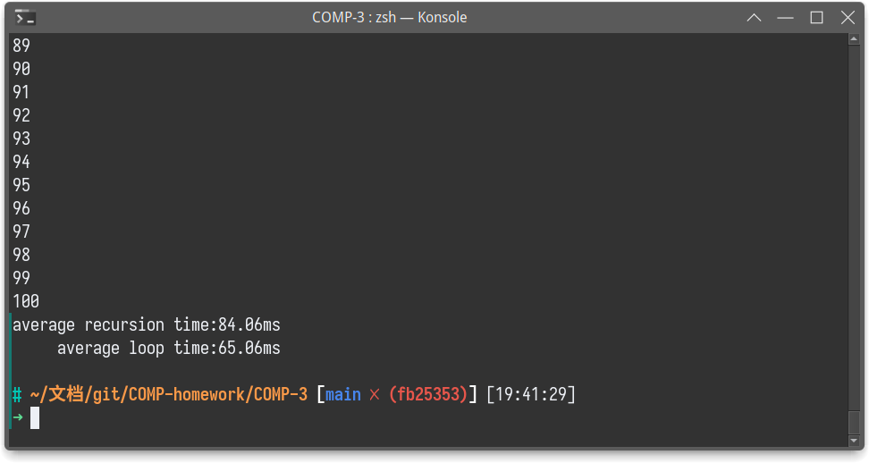
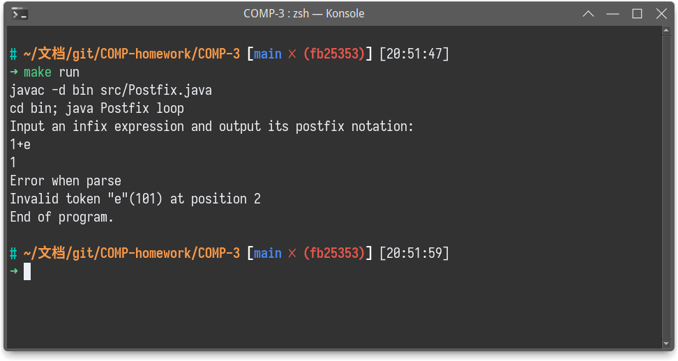
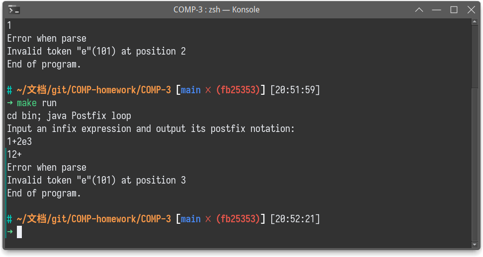
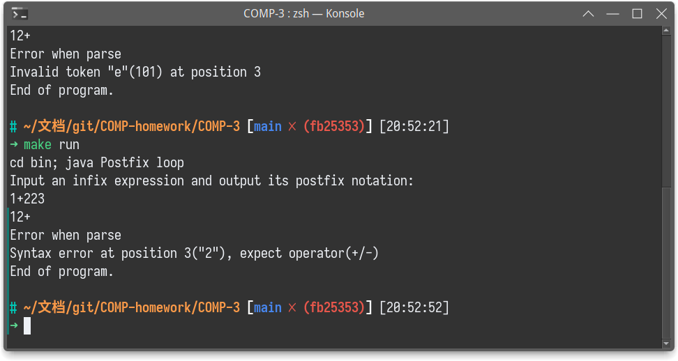
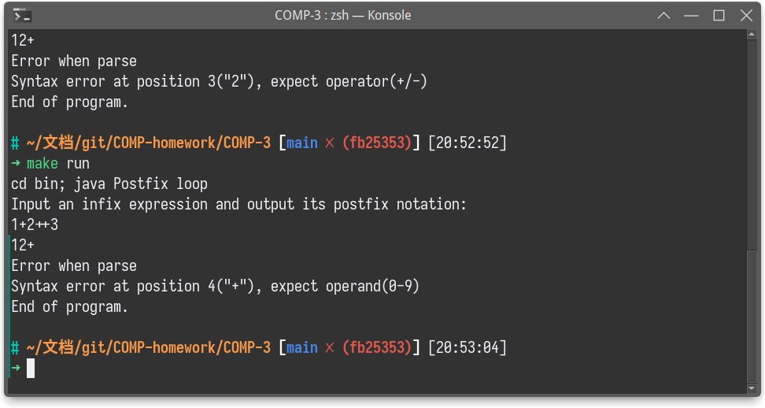
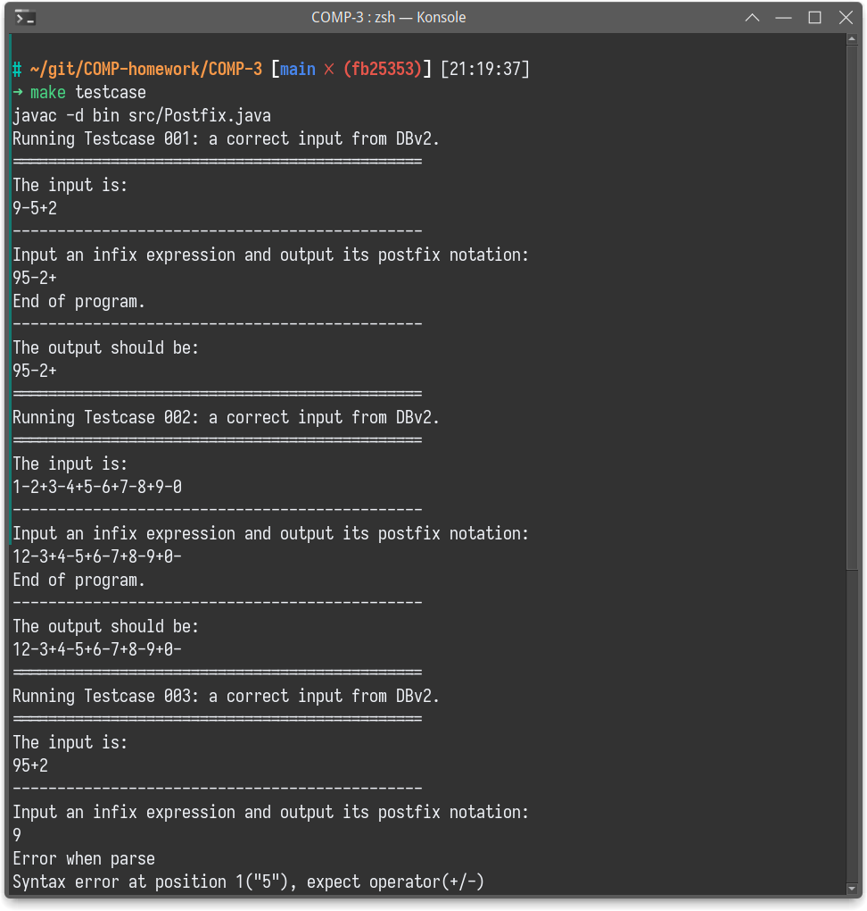
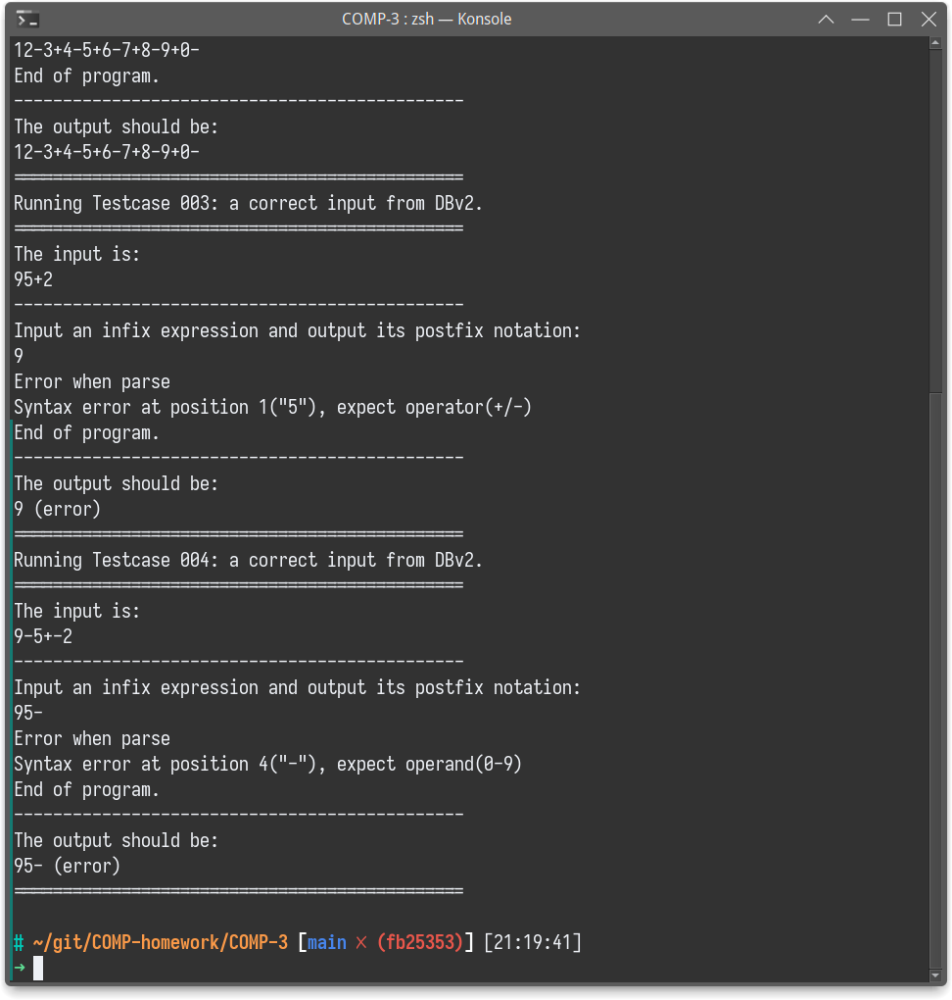

# 后缀表达式 Postfix - 实验报告


| 姓名     | 张烨禧     | 学号     | 18340216           |
| ---------- | ------------ | ---------- | -------------------- |
| 完成时间 | 2021/04/22 | 联系方式 | zetako@outlook.com |

## 1. 静态成员与非静态成员

从结论上来说，在该程序以及我们修改过的程序中，变量`lookahead`是否具有`static`属性对程序的运行**没有影响**。

`static`属性的主要作用是使这个成员变量与具体的某个实例无关；由于在我们的程序中，我们始终只初始化一个实例并且使用这个实例进行解析，因此这个程序中是否使用`static`属性是没有影响的。

但是，对`lookahead`添加这个属性可以使得它在不同的实例之间保持一致，这使得我们在进行多进程优化等操作时，能够让不同的实例共享一个输入流和lookahead，从而加速解析进程。

## 2. 尾递归与循环

根据理论分析，经过我们修改的循环版本应该会稍微比原始的尾递归版有效率；但是可以预见的是，这个效率的差距会比较小，因此如果我们需要通过实验来证明这一点，我们需要扩大我们输入的规模，并且进行多次重复测试以得到合适的结果。

基于这个需求，我们首先需要能够生成一个长字符串。原本我使用python脚本来实现这个功能，但是在我们需求的长字符串的场景下，python脚本的效率问题比较突出，因此我们转用C语言来负责生成这个字符串。

```c

#! /usr/bin/tcc -run

#include <stdio.h>
#include <stdlib.h>
#include <unistd.h>
#include <time.h>

int main(int argc, char *argv[]) {
    int repeatTime;
    if (argc == 2) {
        repeatTime = atoi(argv[1]);
    } else {
        return -1;
    }
    const char* dig = "0123456789";
    const char* op = "+-";

    srand(time(NULL));
    int i=1;
    write(STDOUT_FILENO, dig+rand()%10, 1);
    while (i<repeatTime) {
        i++;
        write(STDOUT_FILENO, op+rand()%2, 1);
        write(STDOUT_FILENO, dig+rand()%10, 1);
    }
    write(STDOUT_FILENO, &"\n", 1);
}
```

> 这里我们选择使用`tcc -run`作为我们这个程序的运行条件：这个是tcc（tiny cc）提供的一个特殊的功能，可以将编译结果直接置入内存运行，使得我们能够将C语言的源文件视为脚本/可执行文件来运行。
>
> 若是在tcc不可用的环境下，需要将第一行去掉，正常使用编译器进行编译，并由二进制文件提供输入流。

有了输入之后，我们还需要我们的程序能够根据参数对运行方式（尾递归/循环）、运行记录（运行时间等）进行改变，因此我在主类中实现了简单的参数解析，来方便我们的自动化脚本运行。

```java
Boolean timeFlag = false;
Boolean recursionFlag = false;
Boolean recordFlag = false;
if (args.length >= 1) {
	for (Integer i=0; i<args.length; i++) {
		switch (args[i]) {
            case "time":
                timeFlag = true;
                break;
            case "recursion":
                recursionFlag = true;
                break;
            case "loop":
                recursionFlag = false;
                break;
            case "record":
                recordFlag = true;
                break;
            default:
                System.out.println("Wrong Args at pos "+Integer.toString(i)+": "+args[i]);
                break;
        }
    }
}
```

我们测试所用的时间由java程序本身统计，并将其输出到文件中；这之后将由一个python脚本处理，得出其平均值：

```python
#!/usr/bin/python
# -*- coding: UTF-8 -*-

import numpy as np

recursionNum = np.loadtxt("../bin/recursion-record.log")
# print(recursionNum)
recursionNum = np.average(recursionNum)
print("average recursion time:{}ms".format(recursionNum))
loopNum = np.loadtxt("../bin/loop-record.log")
# print(loopNum)
loopNum = np.average(loopNum)
print("average   loop    time:{}ms".format(loopNum))
```

某次测试中完成的结果如下：



可以看出，在我们使用500000个操作数，100次重复实验中，我们得出的结果是尾递归的版本确实比循环版本的性能要差一点。

除此之外，由于我们要求的输入比较大，我们需要重定义jvm运行时的堆栈空间，以防止发生栈溢出的情况；因此我们需要在程序时指定参数：

```shell
java -Xss32M Postfix
```

## 3. 错误处理

我们处理两种错误：

- 词法错误：出现了非法字符（0-9，+，-之外的字符）
  - 出现在操作数位置 - 1
  - 出现在操作符位置 - 2
- 语法错误：字符出现在错误的位置
  - 无效的操作符 - 3
  - 无效的操作数 - 4

我们针对循环版本进行错误处理的添加。

每次遇到错误时，我们抛出一个Error，通过这个Error的信息文本来表示错误的类型，位置和原因。

在循环版本中，我们一般在rest部分（`restLoop`函数）捕捉出现在操作符位置的错误（1,3），此时需要注意，我们非法字符的判断应该减去三个表示文件结束的特例：EOF、CR、LF，它们对应的`lookahead`值分别为-1、13、10。因此，我们的错误处理部分如下表示：

```java
if ( Character.isDigit((char)lookahead) ) {
    throw new Error(String.format("Syntax error at position %d(\"%c\"), expect operator(+/-)", pos, lookahead));
} else if (lookahead != -1 && lookahead != 10 && lookahead != 13){
    throw new Error(String.format("Invalid token \"%c\"(%d) at position %d", lookahead, lookahead, pos));
}
```

然后，我们会在`term`函数中处理出现在操作数位置的错误（2,4），此时就不需要考虑上述的特例了：

```java
void term() throws IOException {
    if (Character.isDigit((char)lookahead)) {
        System.out.write((char)lookahead);
        match(lookahead);
    } else if (lookahead != '+' && lookahead != '-') {
        throw new Error(String.format("Invalid token \"%c\"(%d) at position %d", lookahead, lookahead, pos));
    } else {
        throw new Error(String.format("Syntax error at position %d(\"%c\"), expect operand(0-9)", pos, lookahead));
    }
}
```

至此，我们应该能针对上面分析的错误各自抛出对应的错误对象，我们仅需要在解析函数中，在try-catch块中将错误信息打印即可：

```java
void expr() throws IOException {
    try {
        term();
        restLoop();
    } catch (Error e) {
        System.out.write('\n');
        System.out.println("Error when parse");
        System.out.print(e.getMessage());
    }
}
```

针对上面分析的4种错误，我们的测试如下：









另外，对于项目中已经提供的测试用例，我将其整合在makefile中，使用`make testcase`进行测试：



