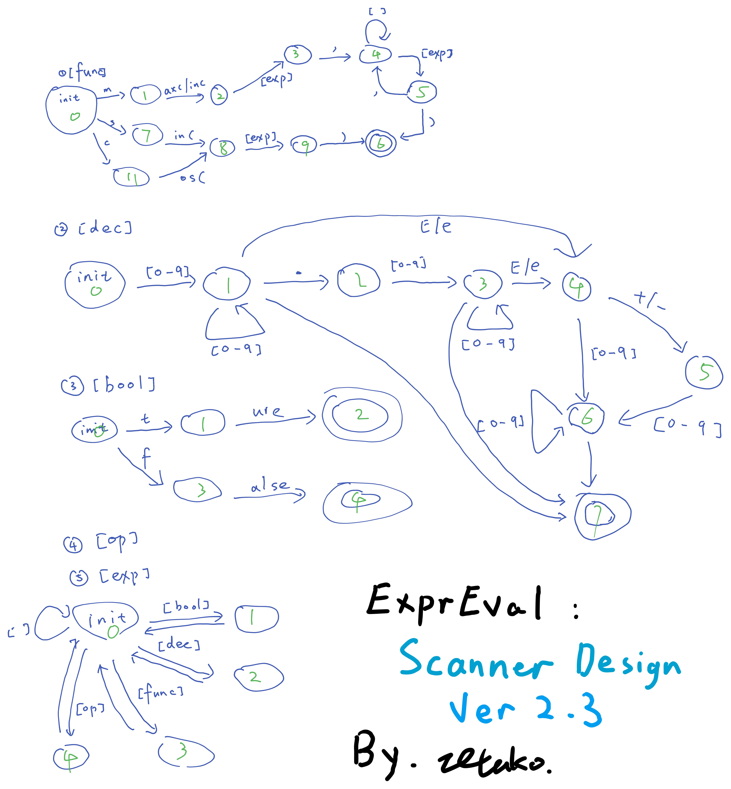

# 编译原理实验4 - 表达式计算器ExprEval

| 姓名     | 张烨禧             |
| -------- | ------------------ |
| 学号     | 18340216           |
| 联系方式 | zetako@outlook.com |

[TOC]

## 0. 语法二义性

如果只考虑题目提供的BNF定义，由于该定义不包含优先级，很明显这是存在二义性的。我们举一个最简单的四则运算输入`1 + 2 * 3`，在BNF定义下，我们无法分析是先处理乘法还是加法。

但是，我们还有运算符优先级的表，通过这个表，我们能够区分上文所述的情况的处理顺序了；即使遇到相同的优先顺序的符号，我们也可以使用左优先的规则来完成判断。

有了上面的前提，我们可以确定我们可以通过适当的规则以及OPP表完成我们的解析。

## 1. 词法分析 - Scanner

词法分析的部分主要将图形前端传入的一个表达式字符串解析成之后语法可以解析的Token串。

### 1.1 Token的定义

Token是语法解析中的一个基本单位，我们定义Token类来表示这一概念；Token类的每一个实例都表示一个Token。Token的定义如下（省略实现）：

```java
public class Token {
    /*===== Members =====*/
    private String token;
    public enum TokenType {
        oprend_dec, oprend_bool, operator, function, end
    };
    private TokenType type;
    
    public Boolean OPPTagDefined;
    public String OPPTag;

    private static final String operatorStr = "(,),-,^,*,/,+,=,<>,<,<=,>,>=,!,&,|,?,:";
    public static final Set<String> operatorSet = new HashSet<String>(Arrays.asList(operatorStr.split(",")));

	/*===== Methods =====*/
    public Token(String _token, TokenType _type) throws LexicalException;
    public String getToken();
    public TokenType getType();
    public Double getDoubleValue() throws LexicalException;
    public Boolean getBooleanValue() throws LexicalException;
    public Boolean equals(Token otherToken);
    public Boolean validate() throws LexicalException;
}
```

下面简要说明个成员变量以及方法的职责与作用：

- 内嵌类：
  - `TokenType`：枚举所有Token类型的枚举类；Token类型包括：
    - `oprend_dec`：数字
    - `oprend_bool`：布尔值
    - `operator`：操作符
    - `funtion`：函数操作符
    - `end`：特指`$`，用在OPP过程中
- 成员变量：
  - 基础属性：
    - `token`：该token对应的字符串
    - `type`：该token的类型
  - OPP解析属性：
    - `OPPTagDefined`：`OPPTag`是否定义，由Parser维护
    - `OPPTag`：由Parser维护的Token的OPP标签，用来查询OPP表
  - 引用属性：
    - `operatorStr`：用来初始化下面的`operatorSet`
    - `operatorSet`：所有操作符的集合，方便验证一个字符串是否为操作符
- 方法：
  - 基础方法：
    - `Token()`：构造函数，初始化成员变量
    - `getToken()`：获取`token`
    - `getType()`：获取`type`
    - `equals()`：检查该`Token`是否与另一个`Token`表征同一个token
  - 属性解析：
    - `getDoubleValue()`：若表示的token为数字，则解析出`Token`对应的数值
    - `getBooleanValue()`：若表示的token为布尔值，则解析出`Token`对应的布尔值
    - `validate()`：检查`token`是否与`type`匹配

### 1.2 构造DFA

在完成Parser的具体实现之前，我们先尝试绘制DFA用于方便我们的编写；该DFA表示从起始状态开始，Parser如何逐字符地读取表达式，在何时将取得的字符转换为Token。



我们的这个DFA设计分为几个子DFA；先由最下方的exp开始，解析时根据需要调用不同的子DFA，在子DFA到达终结状态（带两个圈的状态）时，将其转化为`Token`。图中没有列举出解析操作符的DFA,是因为这部分解析比较简单而且涉及状态较多。

### 1.3 Scanner的实现

先来看Scanner的定义（省略实现）：

```java
public class Scanner {
    /*===== Members =====*/
    public List<Token> tokenStream;
    private Integer lookaheadIndex;
    private Integer start, end;
    private Integer stateCode;
    private String rawString;

    private Set<Token> leftBracket;
    
	/*===== Methods =====*/
    public Scanner(String raw);
    public void printStream();
    private String lookahead(Integer n);

    private Boolean funcState() throws ExpressionException;
    private Boolean funcScan() throws ExpressionException;
    private Boolean decState() throws LexicalException;
    private Boolean decScan() throws ExpressionException;
    private Boolean boolScan() throws LexicalException;
    private Boolean opScan() throws LexicalException;
	private Boolean exprScan() throws ExpressionException;

    public Boolean scan() throws ExpressionException;
}
```

同样

## 2. 算符优先级解析 - OPP

## 3. 语法分析 - Parser

## 4. 测试 & 实验结果

